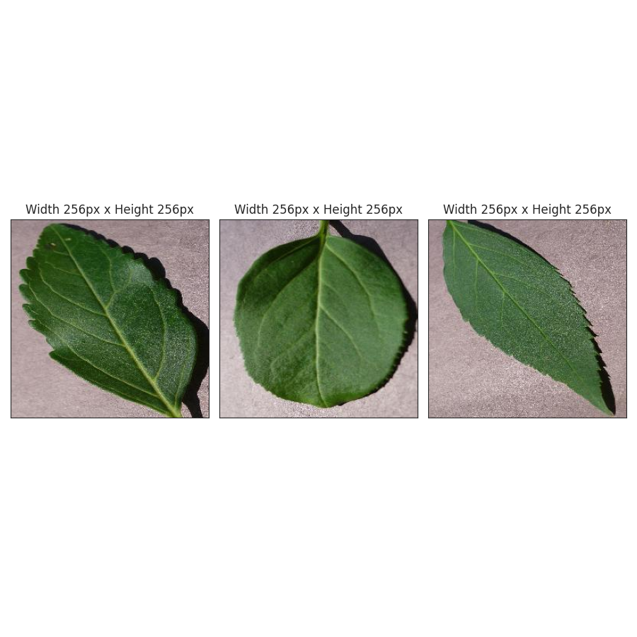
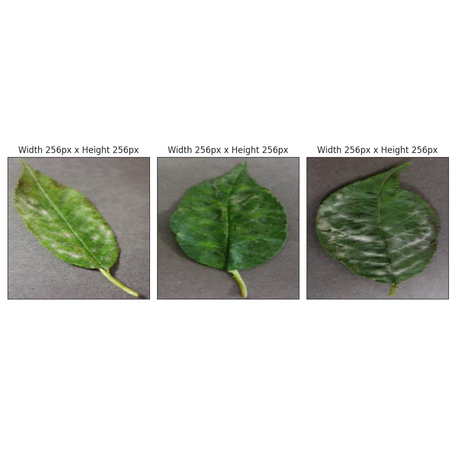
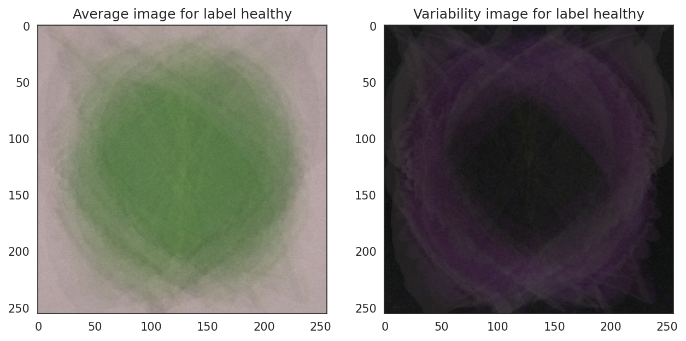
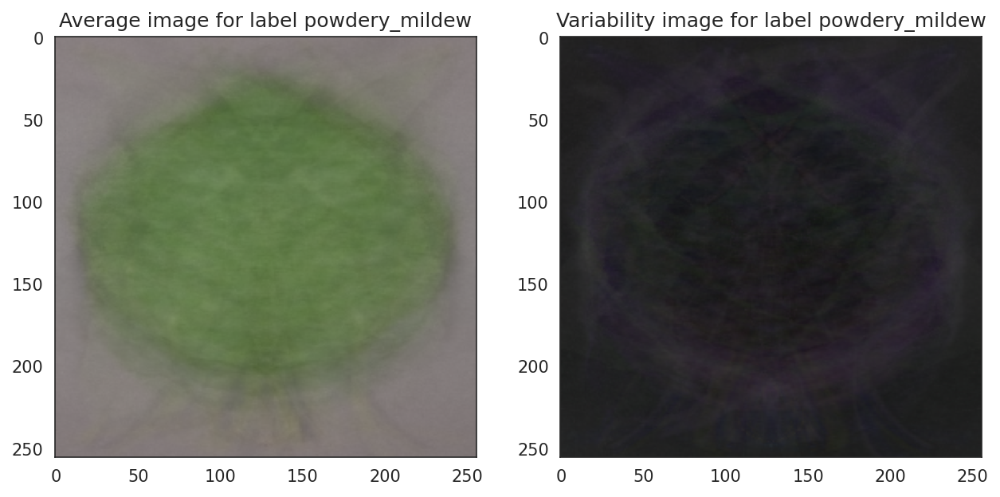
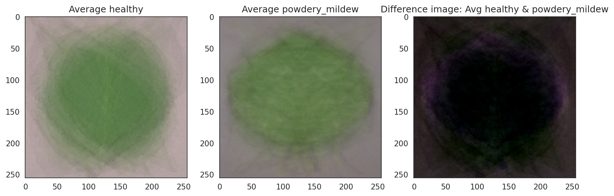
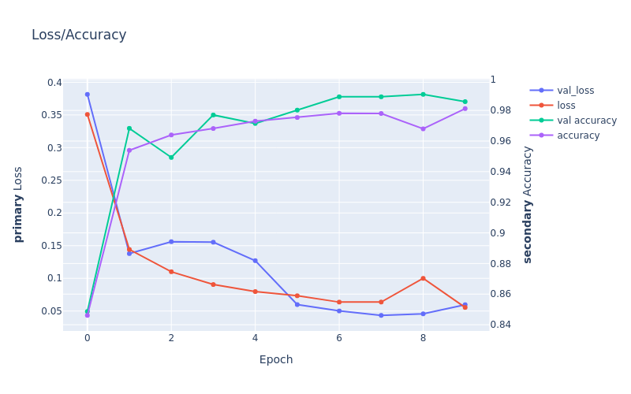
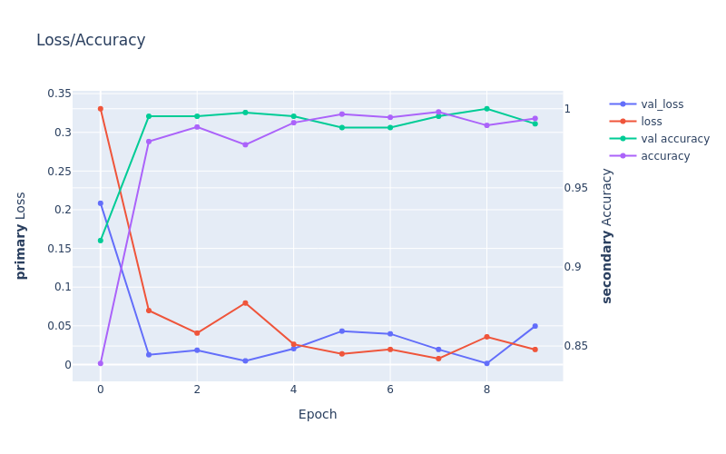
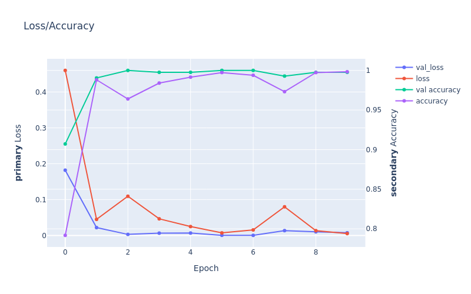
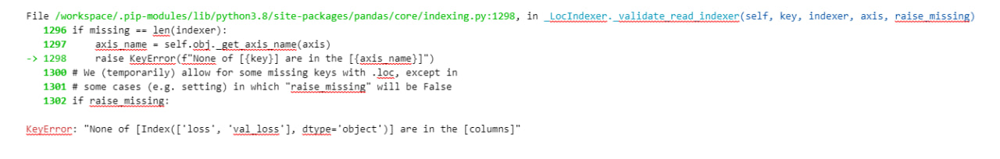

## Table of Contents
1. [Dataset Content](#dataset-content)
2. [Business Requirements](#business-requirements)
3. [Hypothesis and validation](#hypothesis-and-validation)
4. [Rationale for the model](#the-rationale-for-the-model)
5. [Trial and error](#trial-and-error)
6. [Implementation of the Business Requirements](#the-rationale-to-map-the-business-requirements-to-the-data-visualizations-and-ml-tasks)
7. [ML Business case](#ml-business-case)
8. [Dashboard design](#dashboard-design-streamlit-app-user-interface)
9. [CRISP DM Process](#the-process-of-cross-industry-standard-process-for-data-mining)
10. [Bugs](#bugs)
11. [Deployment](#deployment)
12. [Technologies used](#technologies-used)
13. [Credits](#credits)

## App deployed hete [ml5-mildew-detection_herokuapp](LINK)

# Dataset Content

- Dataset consist of 4208 photos of cherry leaves both healthy and infected with [fungus](https://en.wikipedia.org/wiki/Powdery_mildew). Disease that affect wide range of plants however client interested in Cherry Trees mostly. All images taken from Farmy & Foody. Customer is concerned about supplying compromised quality product. 
- Dataset located at [Kaggle](https://www.kaggle.com/datasets/codeinstitute/cherry-leaves)
- This project based on fictious story to apply machine learning algorithms to solve problem which later on could be used in real world scenario.

## Business Requirements

Our customer Farmy & Foody contacted us to resolve non trivial issue in agricultural sector. And we are trying to create Machine Learning system that can help. Core problem is cherry leaves that are infected by fungus (Powdery Mildew). At the moment this process takes around 30 minutes per tree. Infected trees treated with fungicide. Due to size of customers (thousands trees all over the country) this process could be time consuming. In order to increase efficiency one of the solutions is Machine Learning model. Our system should make a decision based on an image of cherry leaves and give answer whether it is "Healthy" or "Infected"

- Customer interested in app that can:

1.  Visually differentiate healthy leaf from infected by powdery mildew.
2.  Predicting base on image, if leaf infected or healthy.
3.  Receiving prediction report of leaves.

## Hypothesis and validation

1. *Hypothesis:* Leaves that are infected have marks compare to heathy ones
    - **Validation** Understand of how Powdery Mildew look like.

2. *Hypothesis:* If image contains some part of leaf (image would contain tree instead of a leaf)
    - **Validation** Cut available dataset in different proportions and train model on it

3. *Hypothesis:* Which activation functions is better perfomed at this model. Compare them.
    - **Validation** Each activation function is better for certain problem. Understand differences between them. Train same models with different activatoin functions

### Hypothesis 1 

 -  Leaves that are infected have marks compare to heathy ones

If leaf is infected by Powdery Mildev we would see some classical marks as: pale yellow leaf spots, round lesions on either side which will develope to white powdery spots on the leaves. This understanding we should provide to our system. But how? Firstly, we need transform, split and basically prepare our data for learning for  best learning outcome.

Once we know we should prepare our dataset by normalization **before** training our model. In order to normalize our images we need to calculate meand and standart deviation for our images. **Mean** is dividing the sum of pixel values by the total number of pixel in dataset. **Standart deviation** basically tell us how bright or dark image is. Brighter image is more "busy" it is, if standart deviation is lov that means brightness of the picture is similar across picture. We do that with some mathematical calculation.

---
We can spot difference between healthy ad infected leaf based on this image montage.

---

Lookig at avarage and variability images we can spot more white spotes and lines on the infected leaves

---

On the other hand no visual differenceson avarage infected and healthy leaves here

---

System is capable of detecting differences in our leaves dataset so our learning outcome would be high. This is important step as we making sure that our model can understand patterns and features so we can make predictions for new data but with same problem.

### Hypothesis 2

 - Image that contains overlapped or partial image of the leaf

Our dataset consist of images of a single leaf which might be not easy to collect as this requires human. And if you have thousands of trees making photo of each leacf of each tree might be a problem on a big scale. One of the solutions might be taking a picture of a tree itself from different angles ( let's say 4 so 1 image per side of a tree) and with high resolution camera. Which will make entire process much faster. On the other hand we receive just 4 images of couple thousands (depends on size of a tree) of leaves which might be overlaped by each other. In one picture we would have both healthy and infected leaves, shape and form of the leaf would be different due to overlaping with another leaf or a branch. Idea is to check if this will decrease accuracy of the model
To validate we will use dataset of artificially modified leaves to simulate overlapping and other conditions. dataset will contain both normal images and partiall images of the leaves.

Model was similar the only difference was that we cut our images in 3 similar pieces which made dataset 3 times bigger, model showed worst results in accuracy and loss due to higher amout of images. Model overfitts as expected. Model with images of full leaves showed better results in learning curves gaps between training and validation as well learning rate much more consistent.

Loss/Accuracy plot model with leaves cut in 3 parts

Loss/Accuracy plot model with normal leaf

Having images of full leaves shows better result compare to leaves cut in a pieces. 

### Hypothesis 3

 - Which activation functions is better perfomed at this model. Compare them.

 If we would generalize of what our model should do we can escribe this like image classification. Classification could be just between 2 classes - binary or containing more than 2 classes - multiclass. Our model consists of just 2 classes so we can think about it more like binary classification
In this case there are activation functions created for this like **sigmoid**. Each solutions has some limitations. Output would consist only of 1 node. As 1 is maximum value than if result if more than 0.5 we would receive class healthy and less than 0.5 infected. Model learns patterns during backpropogation. Backpropogation this is a process when output of the input data goes through reevaluation in that layer so basically sending in backwards wo update gradient. Which will lead to accuracy improvement and smaller loss. Looks like no problems but actually it is one. 

Sigmoid **saturate and kill gradient**. Because sigmoid between 0 and 1 function produce values that are close to 0 or 1 and gradient (learning rate) becomes very small making model difficult to learn as gradients become to small. With time gradient becomes too small or "killed" as a result model will converge slowly of fail to do so.

Our problem could be cosidered as multi-class as we have 2 classes and here **softmax** function could be used with 1 node per each class in the output so 2 in our case. Major difference is that softmax calculates probability disttribution based on previous layers and formula inside of the function where max value is 1. Class that is closer to 1 would be chosen. One of the limitation that classes should be mutually exclusive and sensitivity to outliers as softmax use exponential calculation. 

In order to understand we will plot some charts with learning curve which will tell us how model been learning during time. We would look if model overfit or underfit.
Chart creates based of ammount of Epoch for x-axis. Epochs are how many times modle wpassed through dataset and adjust parameters. Accuracy is a number of when model made correct prediciont. and Loss whan model failed and made wrong prediction. 

On our chart if we would see that our lines perfectly follows each other that is not a good sign as that means model ovetfitted and just learned patterns of a given dataset on the other hand underfitting is when lines parallel or not following data at all also not good as that means that our model cannot learn patterns of the data and we need to change our parameters. So we are looking for something in between so model can understand pattern on training dataset and give correect prediction on new unseen data

Model was trained during 10 epochs with same hyperparameters on both examples. Both model showing overfitting as expected. Although **sofmax** activation function showed better result in learning rate and showed smaller gap in training/validation sets

Loss/Accuracy plot model with sigmoid

Loss/Accuracy plot model with sofmax

After testing both models we choose softmax as activation function.

# Rationale to map the business requirements to the Data Visualizations and ML tasks

The model has 1 input layer, 3 hidden layers (2 ConvLayer, 1 FullyConnected), 1 output layer.

### CRISP-DM Method

CRISP-DM methodology widely used in data mining and AI development. Method provides structured approach to planning project. There are six phases:
1. Business Understanding: here objectives and requirements are defined. Understanding of the problem and setting goals that the project should achieve.
2. Data Understanding: data collected and explored so we have more understanding of data.
3. Data Preparation: Data is cleaned , transformed and prepared for analysis and modeling
4. Modeling: different rechnique applied to the data and results are evaluated for efectiveness for meeting our goals
5. Evaluation: model results are evaluated if they met project objectives. Assessing accuracy, reliability, validity and if model suitable for deployment.
6. Deployment: model deployed and running. Results monitored to ensure that the model continues to meet project objectives

Source:
[CRISP-DM](https://www.datascience-pm.com/crisp-dm-2/)

# Model

Creating model and settind hyperparameters with hidden layers been achieved with trial and error way.
This structure appear in my case best one according to my goals

- Model should predict on new dataset if leaf infected or not with 97% accuracy.

- Model should save company time, resources and money as this process is manual at the moment.

- Model should use as less computational power as possible while still providing correct prediction

### Which hyperparameters I choose

- Conv2D - input layer been chosen as it is subtype of Neural Network that is mainly used for image recognition. Two-dimensional as it is typicall for image data, one-dimensional typically used for time series or text, three-dimensional ussed for 3d image data like MRI or CT in medicine
- Kernel size - is set to 3x3. This filter slide across input tensor in horizontical and vertical directions (stride =1). As a result of this filter creates map of features or pattern of input data. Larger kernel will create more trainable parameters that could lead to overfitting
- Activation - for input and hidden layers is ReLu as it is fast and computaional light
- MaxPooling2D - extracts the most import features after convolutional layer and reduce computational cost as well as number of parameters. **Max**pooling helps us to choose lighter pixels and in our case we are intersted in brighter ones as infected leaves are brighter due to fungus if we would be interested in darker pixels we would use **Min**pooling
- Flatten - converts multidimentional tensor to one-dimensional and we need these as fully conected layer takes as input only one-dimensional vectors.
- Dense - or fully connected layer where each neuron connected to each neuron from previous neuron. Number of neurons depends on complexity of task. 
- Dropout - layer that turns of neurons in a specified layer so they don't contribute to a next layer. We turn off 50% of neurons to avoid overfitting

Source:
[Activation functions](https://wandb.ai/shweta/Activation%20Functions/reports/Activation-Functions-Compared-With-Experiments--VmlldzoxMDQwOTQ)

## Model compilatiom

- Loss: compares target and predicted values of training data. Categorical_crossentropy used since we are using softmax.
- Optimizer: algorithm that adjusts the parameters of a neural network during training in order to minimize the error between the predicted output and the actual output. Used ____ as it perfom best in our case
- Metrics: accuracy used as it provides simple and intuitive measure of how well model is performing. Measures percentage of correctly predicted examples

Source:
[Loss functions](https://towardsdatascience.com/loss-functions-and-their-use-in-neural-networks-a470e703f1e9#:~:text=The%20most%20commonly%20used%20loss,of%20the%20pre%2Dset%20categories.)
[Optimizer](https://www.analyticsvidhya.com/blog/2021/10/a-comprehensive-guide-on-deep-learning-optimizers/)

## Business Requirement 1: Data Visualization

> Visually differentiate healthy leaf from infected by powdery mildew

**User Story**

- As a User I want interactive, easy to navigate and clear dashboard so I can understand data. 
- As a User I want to display avarage and variability image so I can differentiate healthy and infected leaves
- As a User I want to display difference between average healthy and infected leaf, so I can visually diffferentiate them
- As a User I want to display images for healthy and infected leaves so I can visually differentiate them

All User stories been implemented in development Dashboard:

* Easy navigating side bar
* Displaying difference of avarage healthy and infected leaves.
* Displaying avarage variability of the healthy and infected leaves.
* Image montage of the leaves

## Business Requirement 2: Classification

>Predicting base on image, if leaf infected or healthy.

**User Story**

- As a user I want model that oredicts with 97% of accuracy if leaf is healthy or infected.

User story is implemented in Dashboard:

* User can upload own set of images with the help of created widget to receive prediction. (Max size of the file is 200MB)

## Business Requirement 3: Report

> Receiving prediction report of leaves.

**User Story** 

- As a User I want to receive report of the predictions on new data.

User story in implemented in Dashboard:

* Every new dataset of images new report would be generated with prediction.

# ML Business Case

- Machine Learning model should be able to predict on given dataset of cherry leves if they are infected or healthy. Based on this information we consider this problem as supervised model, with 2-class, single-label, classification
- Outcome of the model to provide better and faster way of predicting whether leaf is healthy of infected
- Model accuracy of 97% or above
- The model output is defined as a flag, indicating if the leaf contains any feature that can show that the tree is infected. Owner of the plantation will take a picture of some leaves of the tree and upload them to the App.
- Heuritics: Current method of detection is labour based. Every tree takes around 30 minutes to inspect and taking samples. This way of inspection have high human error and time consuming.
- Dataset provided by Farmy & Foody tha contains 4208 images of cherry leaves. Could be download at [Kaggle](https://www.kaggle.com/datasets/codeinstitute/cherry-leaves)

# Dashboard Design (Streamlit App User Interface)

##  Page 1: Quick Project Summary
- Quick project summary
    - General information
        - **Powdery Mildew** is a fungal disease that affects a wide range of plants. Powdery mildew diseases are caused by many different species of ascomycete fungi. Infected plants display white powdery spots on the leaves and stems. The lower leaves are the most affected 
        - Typical symptoms are : white patches of fungal growth develop on the lower surface of the leaf, leaf edges curl upwards, exposing the white, powdery fungal growth, purple to reddish blotches may also develop on leaves
    - Project Dataset
        - Provided by customer Farmy & Foody which contains 4208 photos of cherry leaves. Include both healthy and infected
    - Business requirements
        - Customer interested to visually differentiate between healthy and infected leaf
        - Customer interested if peaf is infected by Powdery Mildew
        - Customer interested in prediction report of the dataset

## Page 2: leaves Visualizer

It will answer business requirement #1
- Checkbox 1 - Difference between average and variability image
- Checkbox 2 - Differences between average parasitised and average uninfected leaves
- Checkbox 3 - Image Montage

## Page 3: Powdery mildew Detector

Business requirements #2
- The client is interested in predicting if a cherry tree is healthy or contains powdery mildew.
Business requirements #3
- The client wants to receive report of the prediction.
- Download a set of infected or healthy leaves images from [Kaggle](https://www.kaggle.com/datasets/codeinstitute/cherry-leaves)
- User Interface wit ha file iploader widget. The user can upload multiple cherry leaves images. It will display the image, a barplot of the visual representation of the prediction and the prediction statement, indicating if the leaf is infected or not with powdery mildew and the probability associated with this statement.
- Report that contain table with the image name and prediction results.
- Download button to download the report.

# Page 4: Project Hypothesis and Validation

- Block for each project hypothesis, describe the conclusion and how you validated.

# Page 5: ML Performance Metrics

- Label Frequencies for Train, Validation and Test Sets
- Model History - Accuracy and Losses
- Model evaluation resul

- Pages for Streamlit Dashboard are from [Code Institute](https://github.com/Code-Institute-Solutions/WalkthroughProject01)

# Bugs

When I was creating plots from a model history I got this error

Bug - Every time I was trying to create plot right after evaluation of the model I got such kind of error or just None
Fix - It is impossible to extract history after evaluation as that is reseting history of the model, so creating plots should be doтe beore evaluating model
Found this question in [Stack Overflow](https://stackoverflow.com/questions/62299804/in-tensorflow-2-2-0-my-model-history-history-is-empty-after-fitting-the-data-al) very helpfull.

# Technologies used

- [Heroku](https://www.heroku.com/) To deploy this project
- [Jupiter Notebook](https://jupyter.org/)
- [Gitpod](https://www.gitpod.io/)
- [Kaggle](https://www.kaggle.com/) 
- [Python](https://www.python.org/)
- [Numpy](https://numpy.org/)
- [Pandas](https://pandas.pydata.org/)
- [Plotly](https://plotly.com/)
- [Tensorflow](https://www.tensorflow.org/)
- [Matplotlib](https://matplotlib.org/)

# Deployment

1. Create runtime.txt Python version that supported by Heroku-22
2. Create requirements.txt file that lists all dependencies that program needs to run
3. Log In to your Heroku Account
4. Choose "Create New App" 
5. Add Python buildpack in settings tab
6. Choose Github deployment method and connect project repository
7. Choose branch you want to deploy and click Deploy Branch
8. Select Automatic Deploys or Manual Deploy
9. Once deployed you will see link where you can access your app.

## Forking

- Find reposirory you are [interested](https://github.com/BogdanFSD/ML5-Mildew-Detection) in.
- Find button "Fork" near top right corner and click on it
- Choose where to fork it
- You successfully forked a repo

## Cloning repo

- Find reposirory you are [interested](https://github.com/BogdanFSD/ML5-Mildew-Detection) in.
- Than find button "Clone" and click on it
- Choose "Local" and find option that suits you: HTTPS, Download ZIP, Open with GitHub Desktop
- If you choose HTTPS link than copy a link
- Open you terminal with preinstalled Bash
- Decide where you want store new repo
- Type git clone https://github.com/BogdanFSD/ML5-Mildew-Detection and hit Enter

# Credits

- Leaves dataset was downloaded from [Kaggle](https://www.kaggle.com/datasets/codeinstitute/cherry-leaves) and created by [Code Institute](https://www.kaggle.com/codeinstitute)
- Fungus description taken from [RHS](https://www.rhs.org.uk/disease/powdery-mildews) and [Wikipedia](https://en.wikipedia.org/wiki/Powdery_mildew#:~:text=Powdery%20mildew%20is%20one%20of,ground%20part%20of%20the%20plant)
- CRISP-DM steps taken from [Think Insights](https://thinkinsights.net/data/crisp-dm/)
- Template for this project belongs to [CodeInstitute](https://codeinstitute.net/)
- Jupiter notebooks and pages for Dashboard are from [CodeInstitute Walkthrough](https://github.com/GyanShashwat1611/WalkthroughProject01)

# Acknowledgements

I want to say Thank you to [Code Institue](https://codeinstitute.net/) and my mentor Rohit Sharma

