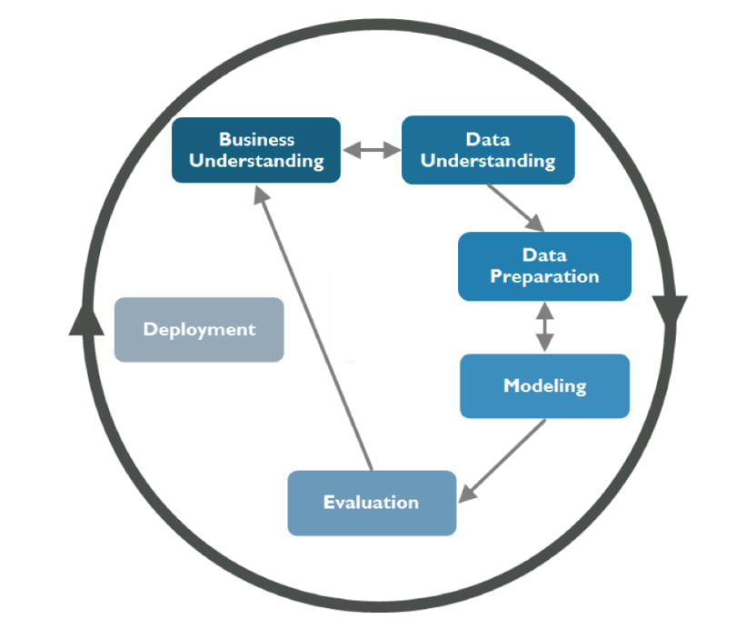

## Table of Contents
1. [Dataset Content](#dataset-content)
2. [Business Requirements](#business-requirements)
3. [Hypothesis and validation](#hypothesis-and-validation)
4. [Rationale for the model](#the-rationale-for-the-model)
5. [Trial and error](#trial-and-error)
6. [Implementation of the Business Requirements](#the-rationale-to-map-the-business-requirements-to-the-data-visualizations-and-ml-tasks)
7. [ML Business case](#ml-business-case)
8. [Dashboard design](#dashboard-design-streamlit-app-user-interface)
9. [CRISP DM Process](#the-process-of-cross-industry-standard-process-for-data-mining)
10. [Bugs](#bugs)
11. [Deployment](#deployment)
12. [Technologies used](#technologies-used)
13. [Credits](#credits)

## App deployed hete [ml5-mildew-detection_herokuapp](LINK)

# Dataset Content

- Dataset consist of 4208 photos of cherry leaves both healthy and infected with [fungus](https://en.wikipedia.org/wiki/Powdery_mildew). Disease that affect wide range of plants however client interested in Cherry Trees mostly. All images taken from Farmy & Foods. Customer is concerned about supplying compromised quality product. 
- Dataset located at [Kaggle](https://www.kaggle.com/datasets/codeinstitute/cherry-leaves)
- This project based on fictious story to apply machine learning algorithms to solve problem which later on could be used in real world scenario.

## Business Requirements

Our customer Farmy & Foods contacted us to resolve non trivial issue in agricultural sector. And we are trying to create Machine Learning system that can help. Core problem is cherry leaves that are infected by fungus (Powdery Mildew). At the moment this process takes around 30 minutes per tree. Infected trees treated with fungicide. Due to size of customers (thousands trees all over the country) this process could be time consuming. In order to increase efficiency one of the solutions is Machine Learning model. Our system should make a decision based on an image of cherry leaves and give answer whether it is "Healthy" or "Infected"

- Customer interested in app that can:

1.  Visually differentiate healthy leaf from infected by powdery mildew
2.  Predicting base on image, if leaf infected or healthy

## Hypothesis and validation

1. *Hypothesis:* Leaves that are infected have marks compare to heathy ones
    - **Validation** Understand of how Powdery Mildew look like.

2. *Hypothesis:* Which model better to choose
    - **Validation** depends on the problem I solve

3. *Hypothesis:* When it perfomed better
    - **Validation** colors, filters algorithms.

### Hypothesis 1 

> Leaves that are infected have marks compare to heathy ones

If leaf is infected by Powdery Mildev we would see some classical marks as: pale yellow leaf spots, round lesions on either side which will develope to white powdery spots on the leaves. This understanding we should provide to our system. But how? Firstly, we need transform, split and basically prepare our data for learning for  best learning outcome.

Once we know we should prepare our dataset by normalization **before** training our model. In order to normalize our images we need to calculate meand and standart deviation for our images. **Mean** is dividing the sum of pixel values by the total number of pixel in dataset. **Standart deviation** basically tell us how bright or dark image is. Brighter image is more "busy" it is, if standart deviation is lov that means brightness of the picture is similar across picture. We do that with some mathematical calculation.

---
We can spot difference between healthy ad infected leaf based on this image montage.

---

Lookig at avarage and variability images we can spot more white spotes and lines on the infected leaves

---

On the other hand no visual differenceson avarage infected and healthy leaves here

---

System is capable of detecting differences in our leaves dataset so our learning outcome would be high. This is important step as we making sure that our model can understand patterns and features so we can make predictions for new data but with same problem.

### Hypothesis 2

---

### hypothesis 3

---

## The rationale for the model

### CRISP-DM Method

CRISP-DM methodology widely used in data mining and AI development. Method provides structured approach to planning project. There are six phases:
    1. Business Understanding: here objectives and requirements are defined. Understanding of the problem and setting goals that the project should achieve.
    2. Data Understanding: data collected and explored so we have more understanding of data.
    3. Data Preparation: Data is cleaned , transformed and prepared for analysis and modeling
    4. Modeling: different rechnique applied to the data and results are evaluated for efectiveness for meeting our goals
    5. Evaluation: model results are evaluated if they met project objectives. Assessing accuracy, reliability, validity and if model suitable for deployment.
    6. Deployment: model deployed and running. Results monitored to ensure that the model continues to meet project objectives

### What I want to achieve

-
-
-
-

### Which hyperparameters I choose

- layers
- number of neurons
- kernel size
- activation function (not sigmoid)
- output
- dropout

## layers

## model creation

# Rationale to map the business requirements to the Data Visualizations and ML tasks

## Business Requirement 1: Data Visualization

- User Story

## Business Requirement 2: Classification

- User Story

## Business Requirement 3: Report
- User Story

# ML Business Case

## Powdery Mildew Detection

-
-
-
-
-

# Dashboard Design (Streamlit App User Interface)

##  Page 1: Quick Project Summary
- Quick project summary
    - General information
        - **Powdery Mildew** is a fungal disease that affects a wide range of plants. Powdery mildew diseases are caused by many different species of ascomycete fungi. Infected plants display white powdery spots on the leaves and stems. The lower leaves are the most affected 
        - Typical symptoms are : white patches of fungal growth develop on the lower surface of the leaf, leaf edges curl upwards, exposing the white, powdery fungal growth, purple to reddish blotches may also develop on leaves
    - Project Dataset
        - Provided by customer Farmy & Foods which contains 4208 photos of cherry leaves. Include both healthy and infected
    - Business requirements
        - Customer interested to visually differentiate between healthy and infected leaf
        - Customer interested if peaf is infected by Powdery Mildew
        - Customer interested in prediction report of the dataset

## Page 2: leaves Visualizer

It will answer business requirement #1
- Checkbox 1 - Difference between average and variability image
- Checkbox 2 - Differences between average parasitised and average uninfected leaves
- Checkbox 3 - Image Montage

## Page 3: Powdery mildew Detector

Business requirements #2
- The client is interested in predicting if a cherry tree is healthy or contains powdery mildew.
- Download a set of infected or healthy leaves images from [Kaggle](https://www.kaggle.com/datasets/codeinstitute/cherry-leaves)
- User Interface wit ha file iploader widget. The user can upload multiple cherry leaves images. It will display the image, a barplot of the visual representation of the prediction and the prediction statement, indicating if the leaf is infected or not with powdery mildew and the probability associated with this statement.
- Table with the image name and prediction results.
- Download button to download the report.

# Page 4: Project Hypothesis and Validation

- Bloack for each project hypothesis, describe the conclusion and how you validated.

# Page 5: ML Performance Metrics

- Label Frequencies for Train, Validation and Test Sets
- Model History - Accuracy and Losses
- Model evaluation resul

# Technologies used

- [Heroku](https://www.heroku.com/) To deploy this project
- [Jupiter Notebook](https://jupyter.org/)
- [Gitpod](https://www.gitpod.io/)
- [Kaggle](https://www.kaggle.com/) 
- [Python](https://www.python.org/)
- [Numpy](https://numpy.org/)
- [Pandas](https://pandas.pydata.org/)
- [Plotly](https://plotly.com/)
- [Tensorflow](https://www.tensorflow.org/)
- [Matplotlib](https://matplotlib.org/)

# Deployment

1.
2.
3.
4.
5.
6.
7.
8.
9.
10.

## Forking

- Find reposirory you are [interested](https://github.com/BogdanFSD/ML5-Mildew-Detection) in.
- Find button "Fork" near top right corner and click on it
- Choose where to fork it
- You successfully forked a repo

## Cloning repo

- Find reposirory you are [interested](https://github.com/BogdanFSD/ML5-Mildew-Detection) in.
- Than find button "Clone" and click on it
- Choose "Local" and find option that suits you: HTTPS, Download ZIP, Open with GitHub Desktop
- If you choose HTTPS link than copy a link
- Open you terminal with preinstalled Bash
- Decide where you want store new repo
- Type git clone https://github.com/BogdanFSD/ML5-Mildew-Detection and hit Enter

# Credits

